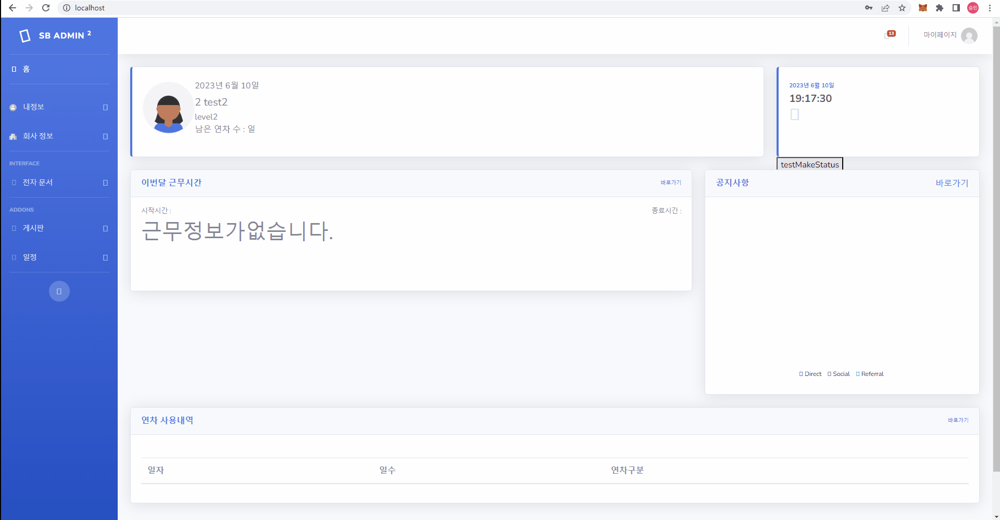

# Link Mall(전자기기 쇼핑몰)

## 목차

- [프로젝트 개요](#프로젝트-개요)
- [팀 역할 분배](#팀-역할-분배)
- [사용 기술 및 도구](#사용-기술-및-도구)
- [기능구현](#기능구현)
  - 기능?
- [배포](#배포)
- [ISSUE](#ISSUE)

## 프로젝트 개요

> **프로젝트:** 쇼핑몰 ( 전자기기 )
>
> **기획 및 제작:** 이승엽, 김태현,정상구,이규원, 전승민
>
> **분류:** 팀 프로젝트 
>
> **제작 기간:** 2023.05.17 ~ 2023.06.22
>
> **배포일:** 미정
>
> **사용 언어:** JAVA, JAVASCRIPT, JSP, MariaDB
> 
> **프레임 워크:** Spring Boot Framework

## 팀 역할 분배
> **팀장:** 이승엽
> 
> 

> **팀원:** 김태현
>
> 
> **팀원:** 이규원
>
> 
> **팀원:** 정상구
>
> 
> **팀원:** 전승민
>전자 결재 신청 : 등록된 Form.html를 가져와서 전자 결재를 신청
>전자 결재 승인/거절: 전자결재 리스트에서 자신이 승인해야 할 리스트만 보여줌 카테고리별로 정렬 가능
>최종 승인/거절 : 승인 거절 시 자신의 결재 승인정보에 들어가서 누가 거절하고 승인했는지 알수 있음

## 사용 기술 및 도구

|**Category**|**Detail**|
|:--:|:--:|
|**FrontEnd**| `HTML5`, `JavaScript`, `JQuery`, `CSS`, `BootStrap`|
|**BackEnd**| `Java(JDK 1.8)`, `Servlet`, `Spring Boot`, `Mybatis` |
|**OS**| `Windows 10`, `Windows 11` |
|**IDE**| `STS4`, `VisualStudio Code`, `DBeaver` |
|**Server**| `TOMCART 9.0.71` |
|**Document**| `Google Drive`, `ERDCloud`, `Notion` |
|**CI**| `Github` |
|**DB**| `Docker`, `MariaDB` |

## 기능구현
### 1 전자 결재
#### 1-1 전자결재 신청
-전자 결재 카테고리 별 신청 양식이 다름

- 등록된 전자 결재 Form(html파일)을 실제 저장소에서 가져와서 뿌려줌

- 비품 신청 양식을 가져와서 뿌려줌

-Html에서 적은 내용을 실제 html파일로 저장
-이미지가 보이지 않는 이유는 베포 서버 기준으로 이미지 Link를 걸어놨기 때문에 나오지 않음

#### 1-2 전자결재 승인/거절

-내가 승인해야 할 신청서가 가져와서 뿌려줌
-전자 결재 카테고리별로 볼수 있음
-하위 카테고리가 없을 시 전체 카테고리만 나오게끔 설정

#### 1-3 전자결재 최종 승인/거절

-관리자가 등록해 놓은 결재자까지 모두 최종 승인시 승인으로 바뀜
-비품같은 경우 기간이 없기때문에 바로 승인
-휴가와 같이 기간이 필요하거나 필요 데이터가 있는 경우 Table을 조회하여 필요한 정보를 저장

#### 1-4

-최종 승인 또는 거절이 되었을 경우 내 결재 정보에서 승인 정보를 알수 있음
-결재 상세 내용을 통해 누가 거절하고 누가 승인했는지 알수 있음
-pdf Libray를 통행 결재 파일만 따로 Pdf로 다운 가능

